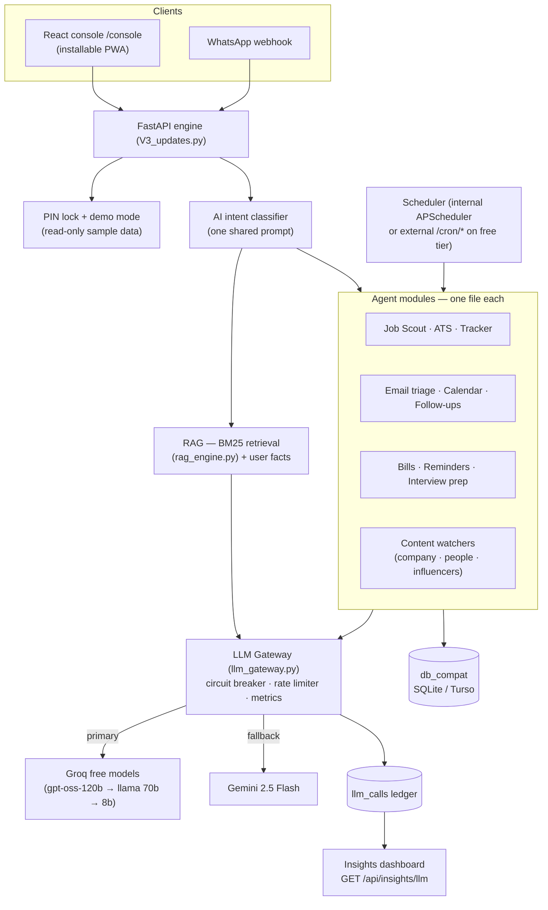

# JARVIS — Personal AI Operations Engine

A self-hosted AI assistant and **job-search cockpit**. A FastAPI engine runs a set of focused
agents (email triage, calendar, job scout, résumé/ATS, application tracker, follow-ups,
interview prep, bills, and more), and a React/Vite console — served at `/console` — presents it
all as a single guided workflow, from discovering a role to landing the offer.

> Built to be cheap to run: free-tier LLMs (Groq → Gemini fallback), SQLite/Turso storage, and
> the browser's own voice for speech, with an optional natural Gemini voice.

## Highlights

- **Home cockpit** — opens to a JARVIS greeting, a prioritized "next steps" queue that deep-links
  into the right tool, and a pipeline pulse.
- **Job-search lifecycle** — Discover → Assess → Apply → Track → Follow-up → Interview → Reflect,
  reflected in the layout, the tools menu, and inline card cues.
- **Agents** — one self-contained module per capability (see the inventory below).
- **Shared memory bridge** — a common memory store both Claude Code and Antigravity read via
  `AGENTS.md`, so context carries across tools.

## Console screens

`Home` (cockpit) · `Jobs` (kanban + tools) · `Insights` (analytics, funnel, skill-gap, calendar
shield, profile freshness) · `Bills` · `JARVIS` (chat) · `Terminal`.

## Tech

FastAPI · SQLite / Turso (`db_compat`) · React + Vite + Tailwind · Recharts · Groq & Gemini LLMs ·
Gmail & Google Calendar APIs · Web Push. Deployed on Render (free tier).

## Architecture

One FastAPI process routes a natural-language message through a shared **AI intent classifier**
(no hardcoded trigger phrases) to whichever agent module owns that capability. Every agent shares
one storage layer (`db_compat` → SQLite locally, Turso in prod) and one **LLM gateway** — so
reliability, failover and metrics are solved once, centrally, rather than per agent.



### Reliability & LLM gateway

Every model call goes through `llm_gateway.py`, an in-process reliability layer around the free-tier
provider chain:

- **Circuit breaker** — after N consecutive failures a provider is *opened* and skipped for a
  cooldown, so we fail over instantly instead of paying a dead provider's latency on every call.
  It closes again on the first success.
- **Rate limiter** — a per-provider sliding-window cap keeps us under free-tier RPM; a full window
  soft-skips to the next provider instead of earning a hard 429.
- **Fails open** — if the gateway would skip *every* provider, the chain is force-tried anyway, so
  the reliability layer can never take the app dark.
- **Live metrics** — `GET /api/insights/llm` fuses the in-memory breaker/limiter state with the
  historical `llm_calls` ledger; the console's **Insights → LLM gateway** card shows circuit state,
  rate-limit usage, breaker trips and provider/model split.

### Demo mode

Setting `JARVIS_DEMO_PIN` (alongside a real `JARVIS_PIN`) adds an **"Explore the demo"** button to
the lock screen. A demo session gets an *empty, non-privileged token* — every protected endpoint
still returns 401 to it, so real data is physically unreachable — and the frontend renders the
whole console from bundled sample fixtures. Shareable as a live demo with zero data exposure.

## Modules

<!-- AUTO:modules -->
- **`application_email_tracker.py`** — Application Email Tracker — reads Gmail and drives the Kanban board automatically.
- **`application_tracker.py`** — Application Tracker Agent — self-contained skill module (Phase 4).
- **`automations.py`** — Automations Agent — generalized scheduling engine (Phase 3 infrastructure).
- **`bill_watcher.py`** — Deadline / Bill Watcher — Phase 5 agent, self-contained module.
- **`calendar_agent.py`** — Calendar Agent — self-contained skill module (Phase 3).
- **`calendar_shield.py`** — Calendar Shield — guards your schedule around interviews.
- **`company_watch_agent.py`** — Company Watch — turns the companies on your Kanban into a live news feed.
- **`daily_standup.py`** — Voice Daily Standup — a single spoken briefing that pulls the whole job search together.
- **`db_compat.py`** — aiosqlite/sqlite3-compatible shim, so the ~91 existing DB call sites across this app.
- **`email_triage.py`** — Email Triage Agent — self-contained skill module.
- **`followup_agent.py`** — Follow-up Agent — nudges stale 'applied' cards with a drafted recruiter follow-up.
- **`gemini_tts.py`** — Gemini text-to-speech — an optional natural voice for JARVIS.
- **`get_gmail_token.py`** — One-time local script to mint a combined Gmail + Calendar OAuth refresh token.
- **`google_docs_agent.py`** — Google Docs Agent — turns an ATS analysis into a tailored-résumé Google Doc.
- **`interview_prep.py`** — Interview Prep Dock — surfaces upcoming interviews from Calendar and, on demand, drafts a.
- **`job_apply_agent.py`** — Job Apply Agent — apply-prep + (approval-gated) auto-apply for the Job Scout pipeline.
- **`job_scout_agent.py`** — Job Scout Agent — self-contained skill module (Phase 4).
- **`llm_gateway.py`** — In-process reliability layer around the multi-provider LLM chain.
- **`local_bridge.py`** — JARVIS Local Bridge.
- **`mcp_sqlite_server.py`** — SQLite MCP Server.
- **`networking_crm.py`** — Thin Networking CRM — track the people behind the applications.
- **`pattern_learning.py`** — Pattern Learning Agent — self-contained skill module.
- **`pdf_import.py`** — PDF Import — self-contained skill module.
- **`people_watch_agent.py`** — People Watch — turns a Networking CRM contact into a watchable feed.
- **`profile_freshness.py`** — Profile-Freshness Nudge — keep your shop-window current.
- **`relevance.py`** — Shared LLM relevance ranker — the reusable "brain" behind every content watcher.
- **`reminders.py`** — Reminders Agent — self-contained skill module.
- **`resume_ats_agent.py`** — Resume ATS Alignment Agent — self-contained skill module (Phase 4).
- **`resume_editor.py`** — Résumé Editor — in-place .docx editing that PRESERVES formatting.
- **`shared_memory.py`** — Shared memory bridge for Claude Code ⇄ Antigravity.
- **`study_tracks.py`** — Study tracks — ordered curricula for the Daily AI Update.
- **`trend_lab_agent.py`** — Trend Lab Agent — weekly app-idea discovery from Reddit + YouTube (free-tier only).
- **`weather_agent.py`** — Weather Agent — self-contained skill module.
- **`workspace_notes.py`** — Workspace Notes — a small DB-backed markdown scratchpad for the console.
<!-- /AUTO:modules -->

## Running locally

```bash
# Engine (always use SAFE_MODE for local runs — throwaway DB, no real sends)
SAFE_MODE=1 .venv/bin/python -m uvicorn V3_updates:app --port 8080

# Console (from jarvis-system-core/)
npm install && npm run build     # served by the engine at /console
```

## Recent changes

<!-- AUTO:changelog -->
- `58f3c47` feat(reliability): LLM gateway (breaker + rate limiter + metrics), demo mode, README architecture _(2026-07-16)_
- `463c202` feat(console): installable PWA — "Install JARVIS" as a desktop/mobile app _(2026-07-13)_
- `e60aab4` feat(watchers): People Watch → CRM nudges + Unified Trends Pulse _(2026-07-13)_
- `6711281` feat(company-watch): slice 1b — news on Kanban cards + interview-prep briefs _(2026-07-13)_
- `b869f49` feat(jobs): declutter the Kanban — compact cards, overflow menu, board filters _(2026-07-13)_
- `5b919f4` feat(watchers): shared relevance engine + Company Watch + "Watch these" in Daily _(2026-07-13)_
- `1c2e3df` feat(influencer): group feed by channel (collapsible) + assign domain on manual add _(2026-07-13)_
- `b4fa0d7` feat(influencer): domains (auto-discover creators), topic filter fix, Shorts filter _(2026-07-13)_
- `7c77459` feat(influencer): finish the watcher upgrade — feed view, RSS, unread badge, Home strip _(2026-07-12)_
- `c9b1db2` feat: Add Social Media Influencer Watcher Agent with console UI _(2026-07-12)_
- `e587052` feat(jobs): multi-source scouting + guided triage funnel (NEW lane, inline Assess, next-step cues) _(2026-07-12)_
- `9417c93` feat(daily): "Rewrite to run offline" — turn un-runnable snippets into stdlib-only that runs _(2026-07-08)_
<!-- /AUTO:changelog -->

---

_Last updated: 2026-07-16 · this README's inventory and changelog are auto-maintained by
`scripts/gen_readme.py` on every commit._
